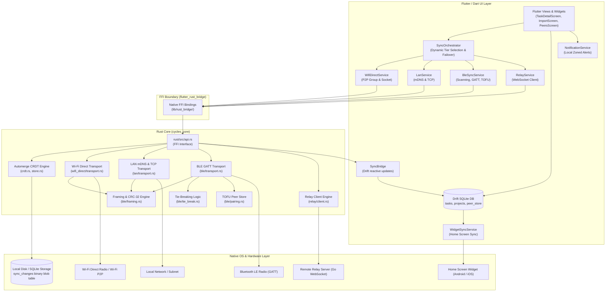

# Cycles — System Architecture

This document details the architectural principles, data flow, subsystem designs, and platform integrations powering **Cycles**.

---

## 1. Architectural Philosophy: Local-First & Multi-Tier Sync

Cycles is built on the [Local-First Software](https://www.inkandswitch.com/local-first/) principles:

1. **No Cloud Required**: The application is fully functional offline. All data is persisted to local SQLite storage immediately.
2. **Proximity-First Cascade**: Devices prefer high-speed peer-to-peer Wi-Fi Direct and local LAN connections when available, automatically falling back to **Bluetooth Low Energy (BLE)** when off-grid or without shared routers, and an optional **zero-knowledge relay** when remote.
3. **Single-Store Boundary**: A single SQLite database (`cycles.sqlite`) houses both the relational model queried by Flutter and the binary Automerge change vectors (`sync_changes`), preventing state drift across processes.
4. **Deterministic Convergence**: Multi-peer concurrent edits merge deterministically via **Automerge CRDTs**, guaranteeing eventual consistency without a central master node.

---

## 2. High-Level System Architecture



---

## 3. The Single-Store Boundary (Drift ↔ Automerge)

To eliminate the common pitfall of CRDT state diverging from the UI state, Cycles uses **one SQLite database file** for both:

1. **Relational Views (`tasks`, `projects`)**: Managed by Drift in Dart. Fully indexed for fast filtering, tag lookups, and real-time Flutter streams (`watchAllTasks()`).
2. **Binary Change Log (`sync_changes`)**: Managed by native Rust. Stores incremental Automerge binary change vectors with actor IDs and hashes.

```
Inbound Payload (Wi-Fi Direct / LAN / BLE / Relay)
                     │
                     ▼
             [ Rust cycles_core ]
                     │
     ┌───────────────┴────────────────┐
     ▼                                ▼
Merges into Automerge Doc    Persists change blob to SQLite `sync_changes`
     │
     ▼ (Yields diff across FFI)
[ Dart SyncBridge ]
     │
     ▼
Upserts into Drift relational `tasks` & `projects` tables
     │
     ▼
[ Flutter UI & Home Screen Widget ] Automatically re-renders
```

---

## 4. Multi-Tier Transport Hierarchy

Cycles features four transport tiers coordinated by `SyncOrchestrator`:

1. **Tier 1: Wi-Fi Direct P2P (Port 47226)**
   - High-throughput device-to-device Wi-Fi without routers (~15–50 MB/s).
   - Driven by Kotlin `WifiP2pManager` on Android and WinRT on Windows.
2. **Tier 2: Local LAN Fast-Path (Port 47225)**
   - Discovers peer instances on the local network via mDNS (`_cycles-sync._tcp`).
   - Connects directly via TCP socket reusing shared framing.
3. **Tier 3: Proximity BLE GATT (Service `0xFD01`, Characteristic `0xFD02`)**
   - Zero-infrastructure proximity transport with chunked 10-byte binary headers and CRC-32 verification.
   - Deterministic tie-breaking prevents dual-central connection collisions.
   - Trust-On-First-Use (TOFU) pairing model.
4. **Tier 4: Remote Zero-Knowledge Relay**
   - Optional, self-hosted Go WebSocket server ([`relay-server/`](file:///home/zenmi/Projects/Cycle/relay-server/)).
   - Pure store-and-forward by `device_id` with shared-secret authentication. Zero Automerge knowledge.

---

## 5. Native Platform Integrations

### 5.1. Android
- **BLE Permissions Plugin** ([`BlePermissionsPlugin.kt`](file:///home/zenmi/Projects/Cycle/android/app/src/main/kotlin/com/example/cycles/BlePermissionsPlugin.kt)): Dynamic runtime requests for `BLUETOOTH_SCAN`, `BLUETOOTH_CONNECT`, and `BLUETOOTH_ADVERTISE` on Android 12+ (API 31+).
- **Wi-Fi Direct Plugin** ([`WifiDirectPlugin.kt`](file:///home/zenmi/Projects/Cycle/android/app/src/main/kotlin/com/example/cycles/WifiDirectPlugin.kt)): Controls `WifiP2pManager` discovery, group ownership, and peer connection.
- **Home Screen Widget** ([`CycleAppWidgetProvider.kt`](file:///home/zenmi/Projects/Cycle/android/app/src/main/kotlin/com/example/cycles/CycleAppWidgetProvider.kt)): Material Design 3 widget displaying pending tasks, priority badges, and quick-add actions.
- **Native JNI Libraries**: Cross-compiled via `scripts/build_android_rust.sh` for `arm64-v8a`, `armeabi-v7a`, and `x86_64`.

### 5.2. iOS
- **BLE Peripheral Bridge** ([`CyclesBlePeripheralPlugin.swift`](file:///home/zenmi/Projects/Cycle/ios/Runner/CyclesBlePeripheralPlugin.swift)): Implements `CBPeripheralManager` GATT server for iOS background advertising.
- **WidgetKit Extension** ([`CyclesWidget.swift`](file:///home/zenmi/Projects/Cycle/ios/CyclesWidget/CyclesWidget.swift)): SwiftUI widget updated via App Group shared container (`group.com.example.cycles`).

### 5.3. Linux
- Direct hardware integration in Rust via `bluer` (BlueZ 5.x D-Bus). Gated under `#[cfg(target_os = "linux")]`.

### 5.4. Windows
- WinRT Bluetooth and Wi-Fi Direct platform capabilities with native C++ FFI runtime.

---

## 6. Task Management & Migration Engine

- **Task Detail Editor** ([`lib/ui/task_detail_screen.dart`](file:///home/zenmi/Projects/Cycle/lib/ui/task_detail_screen.dart)): Rich editing of titles, notes, priorities (0..3), tags, project associations, and due dates/times.
- **Local Notification Engine** ([`lib/services/notification_service.dart`](file:///home/zenmi/Projects/Cycle/lib/services/notification_service.dart)): Schedules exact, timezone-aware notifications via `flutter_local_notifications`. Auto-cancels alerts when tasks are completed or due dates are cleared.
- **Multi-Source Importer** ([`lib/ui/import_screen.dart`](file:///home/zenmi/Projects/Cycle/lib/ui/import_screen.dart)):
  - **Vikunja**: Connects to REST API (`/api/v1/projects`, `/api/v1/tasks/all`) using personal tokens.
  - **Todoist**: Connects to REST API v2 (`/rest/v2/projects`, `/rest/v2/tasks`) with priority inversion handling.
  - **Super Productivity**: Parses local JSON exports, mapping projects, tasks, and subtasks.
  - All imported records receive fresh UUIDs to prevent ID collisions, committing directly into both Drift and the Automerge CRDT log.

---

## 7. Directory Tree

```
Cycle/
├── .agents/                    # Track management & execution records
├── android/                    # Android shell, Kotlin plugins, MD3 widget layout
│   └── app/src/main/
│       ├── kotlin/com/example/cycles/
│       │   ├── BlePermissionsPlugin.kt
│       │   ├── CycleAppWidgetProvider.kt
│       │   ├── MainActivity.kt
│       │   ├── WidgetDataPlugin.kt
│       │   └── WifiDirectPlugin.kt
│       └── res/                # XML layouts, drawables, colors for app widget
├── assets/                     # SVGs, icons, and brand graphics
├── design-system/              # UI tokens, color palettes, and component rules
├── docs/                       # Technical specifications & operator guides
│   ├── CRDT_STORAGE.md         # Single-store Drift + Automerge architecture
│   ├── IMPORT_MIGRATION.md     # Vikunja, Todoist, Super Productivity migration
│   ├── PLATFORM_GUIDE.md       # Linux, Android, iOS, Windows build steps
│   ├── RELAY_DEPLOYMENT.md     # Production deployment for Go relay server
│   ├── SYNC_PROTOCOL.md        # BLE GATT framing, CRC32, tie-breaking spec
│   └── TRANSPORTS.md           # 4-tier transport hierarchy & failover
├── ios/                        # iOS Xcode project & Swift plugins
│   ├── CyclesWidget/           # SwiftUI WidgetKit extension (App Group)
│   └── Runner/
│       ├── CyclesBlePeripheralPlugin.swift
│       └── CyclesWidgetPlugin.swift
├── lib/                        # Flutter Dart application
│   ├── data/                   # Drift SQLite database & SyncBridge
│   ├── rust_bridge/            # Generated flutter_rust_bridge FFI bindings
│   ├── services/
│   │   ├── ble_permission_service.dart
│   │   ├── ble_sync_service.dart
│   │   ├── import/             # Vikunja, Todoist, Super Productivity parsers
│   │   ├── notification_service.dart
│   │   ├── sync_orchestrator.dart
│   │   ├── widget_sync_service.dart
│   │   └── wifi_direct_service.dart
│   └── ui/                     # Reactive UI screens & widgets
├── relay-server/               # Standalone Go WebSocket relay service
│   ├── Dockerfile
│   ├── main.go
│   └── README.md
├── rust/                       # Native Rust engine (cycles_core)
│   ├── src/
│   │   ├── api.rs              # FFI interface functions
│   │   ├── ble/                # BLE discovery, GATT, framing, tie-breaking
│   │   ├── crdt.rs             # Automerge document management
│   │   ├── lan/                # mDNS discovery & TCP transport
│   │   ├── relay/              # WebSocket relay client
│   │   ├── store.rs            # SQLite sync_changes binary persistence
│   │   ├── wifi_direct/        # P2P socket transport
│   │   └── lib.rs
│   └── Cargo.toml
├── scripts/
│   └── build_android_rust.sh   # Android NDK cross-compilation pipeline
└── test/                       # Unit, widget, and FFI integration tests
    ├── import_test.dart        # Importer parsers test suite
    ├── rust_bridge_test.dart   # FFI bridge tests
    ├── widget_test.dart        # UI tests
    └── wifi_direct_test.dart   # Wi-Fi Direct model & transport tests
```
