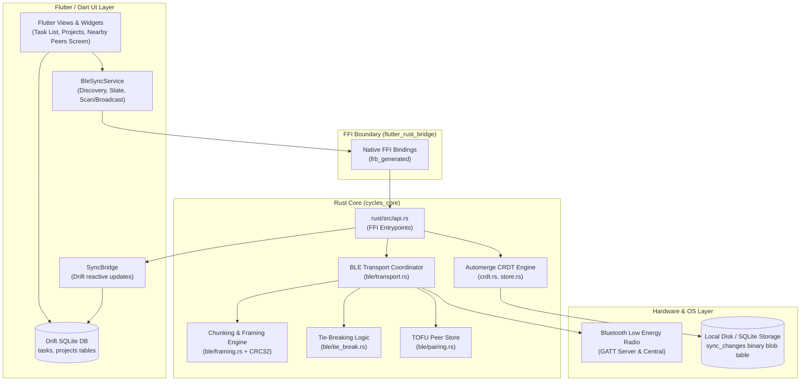

# Cycles — System Architecture

This document details the architectural principles, data flow, and subsystem designs powering **Cycles**.

---

## 1. Architectural Philosophy: Local-First & Proximity-First

Cycles is built on the [Local-First Software](https://www.inkandswitch.com/local-first/) principles:

1. **No Cloud Required**: The application is fully functional offline. All data is persisted to local SQLite storage immediately.
2. **Proximity Synchronization**: Rather than requiring both devices to share an active Wi-Fi router or access an external cloud server, Cycles treats **Bluetooth Low Energy (BLE)** as its primary transport. Two devices can synchronize anywhere—on a subway, in a flight cabin, or off-grid.
3. **Bandwidth Reality**: Task items are tiny (a few hundred bytes each; thousands of tasks total a few hundred kilobytes). BLE's effective throughput (~100 KB/s–1 Mbps) completes synchronization in under a second.
4. **Multi-Writer Conflict Resolution**: All mutations are tracked using Conflict-Free Replicated Data Types (**Automerge CRDTs**), ensuring concurrent offline edits merge deterministically without data loss or central coordinators.

---

## 2. High-Level Architecture



---

## 3. The Single-Store Boundary (Drift ↔ Automerge)

A critical design challenge in local-first apps is preventing state synchronization drift between the UI query engine and the CRDT merge engine.

Cycles solves this via a **single-store architecture**:

- **Physical Storage**: Both relational tables and the CRDT document live inside a single SQLite file (`cycles.sqlite`).
- **`sync_changes` Table**: Rust writes Automerge binary change vectors into a dedicated `sync_changes` table in SQLite.
- **Relational Tables (`tasks`, `projects`)**: Drift manages standard relational tables optimized for indexing, searching, and reactive UI streams (`Stream<List<Task>>`).
- **Inbound Sync Flow**:
  1. Incoming byte frames arrive over BLE.
  2. The Rust transport reassembles chunks and passes the payload to `process_crdt_sync_payload`.
  3. Automerge merges the changes and calculates the diff.
  4. The diff yields structured task updates across FFI to Dart.
  5. `SyncBridge` writes the updates into Drift's relational tables.
  6. Drift triggers Flutter UI reactivity automatically via reactive streams.

```
Incoming BLE Payload
         │
         ▼
[ Rust cycles_core ] ───► Merges into Automerge Document
         │
         ├──────────────► Saves binary changes into SQLite `sync_changes`
         │
         ▼ (Yields diff across FFI)
[ Dart SyncBridge ] ────► Upserts into Drift relational `tasks` table
         │
         ▼
[ Flutter Reactive UI ]  Re-renders automatically via StreamBuilder / Provider
```

---

## 4. Rust Core Subsystems (`cycles_core`)

### 4.1. CRDT Engine (`rust/src/crdt.rs` & `rust/src/store.rs`)
- Manages an Automerge `AutoCommit` document representing task lists.
- Implements vector-clock-based sync protocol generation (`generate_sync_message`) and ingestion (`merge_sync_message`).
- Translates Automerge map entries into structured Rust `Task` structs.

### 4.2. Chunking & Framing (`rust/src/ble/framing.rs`)
BLE GATT MTU is negotiated per-connection and often constrained to 23–517 bytes. Sync payloads range from 1 KB to several hundred kilobytes.
The framing engine breaks payloads into discrete chunks with a 10-byte binary header:

```
┌─────────────────┬────────────────┬──────────────────────┬──────────────────────┬────────────────┐
│  MsgId (2B BE)  │  Seq (2B BE)   │  TotalChunks (2B BE) │  Payload (N Bytes)   │  CRC32 (4B BE) │
└─────────────────┴────────────────┴──────────────────────┴──────────────────────┴────────────────┘
```
- **Integrity**: Every chunk has an independent 32-bit CRC (`crc32fast`).
- **Out-of-Order Handling**: Chunks can arrive out of order; the reassembler stores chunks by sequence index until all $N$ chunks are verified.

### 4.3. Deterministic Tie-Breaking (`rust/src/ble/tie_break.rs`)
When two nearby Cycles devices detect each other simultaneously, both could attempt to connect as Central or advertise as Peripheral.
Cycles resolves this with a symmetric tie-breaking protocol:
- Both devices advertise a presence name: `Cycles-<device_id>`.
- When Device A and Device B discover each other:
  $$\text{Role} = \begin{cases} \text{Central (Initiator)} & \text{if } \text{ID}_A > \text{ID}_B \\ \text{Peripheral (Responder)} & \text{if } \text{ID}_A < \text{ID}_B \end{cases}$$
- Exactly one connection is formed; zero connection collisions occur.

### 4.4. Trust On First Use (`rust/src/ble/pairing.rs`)
- On initial handshake, devices exchange identities and display names.
- Devices are registered into `PeerStore` with initial trust.
- Users can revoke or grant trust directly in the Nearby Devices settings.

---

## 5. Cross-Platform Hardware Architecture

| Platform | BLE Central Role | BLE Peripheral / GATT Server Role | Implementation |
|---|---|---|---|
| **Linux** | Supported (`bluer` / BlueZ D-Bus) | Supported (`bluer` / BlueZ D-Bus) | Direct in `cycles_core` (gated `target_os = "linux"`) |
| **Android** | Supported (Android BLE API) | Supported (Android BLE API) | Native platform channel / JNI passing byte stream to Rust core |
| **iOS** | Supported (`CoreBluetooth`) | Supported (`CoreBluetooth`) | Native platform channel passing byte stream to Rust core |
| **Windows** | Supported (WinRT Bluetooth) | Supported (WinRT `GattServiceProvider`) | Native C++/WinRT bridge to Rust core |

---

## 6. Directory Structure

```
Cycle/
├── .agents/               # Ralph's method tracks and execution records
├── android/               # Android native shell & JNI bindings
│   └── app/src/main/jniLibs/  # Compiled libcycles_core.so for arm64/armv7/x86_64
├── assets/                # App icons, vector SVGs, and brand assets
├── lib/
│   ├── data/              # Drift SQLite database, tables, and SyncBridge
│   ├── rust_bridge/       # Generated FFI bindings (Dart side)
│   ├── services/          # BleSyncService and proximity business logic
│   ├── ui/                # Flutter screens (Task list, PeersScreen)
│   └── main.dart          # App entrypoint and navigation
├── rust/
│   ├── src/
│   │   ├── ble/           # BLE discovery, framing, pairing, tie-break, transport
│   │   ├── api.rs         # flutter_rust_bridge exported API functions
│   │   ├── crdt.rs        # Automerge document management and sync logic
│   │   ├── store.rs       # SQLite sync_changes binary persistence
│   │   └── lib.rs         # Crate root
│   └── Cargo.toml         # Rust dependencies and target-gated Linux bluer
├── scripts/
│   └── build_android_rust.sh  # Android NDK cross-compilation automation
└── test/                  # Flutter widget and Rust FFI bridge tests
```
