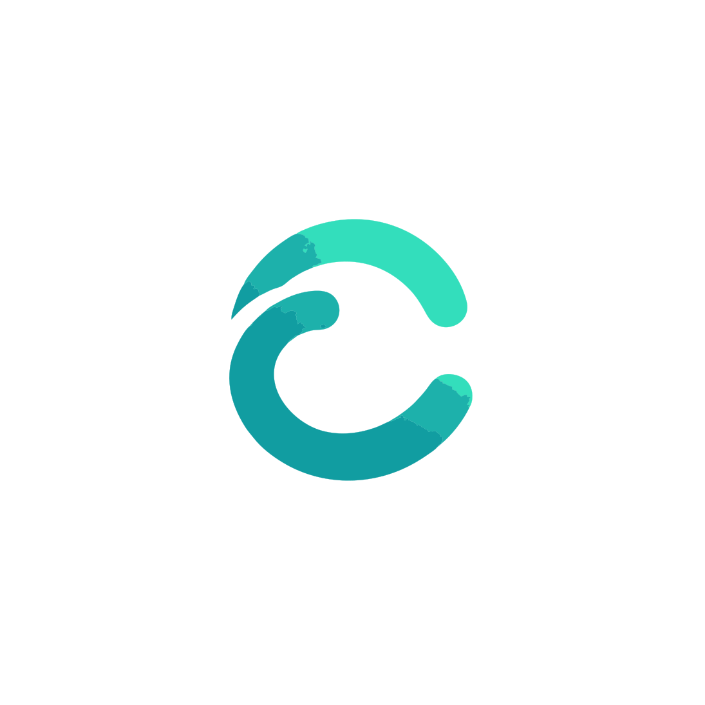

<p align="center">
  
</p>

<h1 align="center">Cycles</h1>

<p align="center">
  <strong>Offline-first, peer-to-peer proximity task sync — no account, no cloud, no server required.</strong>
</p>

<p align="center">
  <a href="LICENSE"></a>
  
  
  
  
  
</p>

---

## 💡 What is Cycles?

Most task managers force a compromise:
- **Cloud-hosted apps** (Todoist, Vikunja, TickTick) require central accounts, constant internet access, and surrender your personal data to remote servers.
- **Local-first apps** (Super Productivity, Logseq) store data on-device, but cross-device synchronization requires manual cloud accounts (Dropbox, WebDAV, Google Drive) and fails whenever devices are offline or off-grid.

**Cycles eliminates this compromise.** It is a true local-first task app that synchronizes directly between devices in physical proximity using **Wi-Fi Direct**, **Local LAN mDNS**, and **Bluetooth Low Energy (BLE)**:
- **Zero Shared Infrastructure**: Sync while camping, on a plane, in a subway, or during internet outages.
- **No Accounts or Telemetry**: No emails, passwords, phone numbers, or analytics tracking.
- **Conflict-Free Replicated Data**: Concurrent multi-device edits merge deterministically via **Automerge CRDTs**.

---

## ✨ Features

- **🌐 4-Tier Transport Hierarchy**:
  1. **Wi-Fi Direct P2P** (~15–50 MB/s direct device-to-device Wi-Fi without routers).
  2. **Local LAN Fast-Path** (~5–20 MB/s mDNS discovery over shared Wi-Fi / Ethernet).
  3. **Proximity BLE GATT** (~50–200 KB/s zero-infrastructure proximity sync with chunked CRC-32 frames).
  4. **Remote Zero-Knowledge Relay** (optional self-hosted Go WebSocket server for out-of-proximity sync).
- **⚡ Single-Store Architecture**: Blends reactive SQLite queries ([Drift](https://drift.simonbinder.eu/)) for sub-millisecond UI rendering with Automerge binary change-tracking (`sync_changes`) for mathematical conflict resolution.
- **📝 Full-Featured Task Management**: Markdown notes, project organization, tag filtering, priority tiers (None, Low, Medium, High), and due dates with time picker.
- **🔁 Recurring Tasks**: Flexible recurrence rules (Daily, Weekdays, Weekly, Monthly, Yearly) that automatically advance and reschedule the next occurrence when completed.
- **🔔 Local Notifications**: Timezone-aware due-date reminders with automated cancellation when tasks complete.
- **📱 Home-Screen Widgets**: Native Material Design 3 widget for Android and WidgetKit extension for iOS (App Group container).
- **🔄 One-Click Migration**: Import tasks, projects, notes, and priorities seamlessly from **Vikunja**, **Todoist**, and **Super Productivity**.
- **🔒 Trust On First Use (TOFU)**: Pair devices securely on the fly. View, trust, or revoke peers anytime in the Nearby Devices screen.
- **🦀 High-Performance Native Core**: Networking, framing, and CRDT math run in compiled native Rust via `flutter_rust_bridge`.

---

## 🏛️ System Architecture

Cycles employs a layered architecture connecting the Flutter UI to the native Rust engine and native OS subsystems:

```
┌─────────────────────────────────────────────────────────────────┐
│                    Flutter / Dart UI Layer                     │
│  ┌───────────────────────┐           ┌───────────────────────┐  │
│  │ Task & Import Screens │           │ Nearby Devices Screen │  │
│  └───────────┬───────────┘           └───────────┬───────────┘  │
│              │ (Streams)                         │              │
│  ┌───────────▼───────────┐           ┌───────────▼───────────┐  │
│  │   Drift Relational    │◄──────────┤   SyncOrchestrator    │  │
│  │   SQLite Database     │ (SyncDiff)│ (WFD, LAN, BLE, Relay)│  │
│  └───────────────────────┘           └───────────┬───────────┘  │
└──────────────────────────────────────────────────┼──────────────┘
                                                   │ FFI
┌──────────────────────────────────────────────────▼──────────────┐
│                    Rust Core (cycles_core)                      │
│  ┌───────────────────────┐           ┌───────────────────────┐  │
│  │   Automerge Engine    │           │ Multi-Tier Transports │  │
│  │ (crdt.rs / store.rs)  │           │(WFD, LAN, BLE, Relay) │  │
│  └───────────┬───────────┘           └───────────┬───────────┘  │
│              │                                   │              │
│  ┌───────────▼───────────┐           ┌───────────▼───────────┐  │
│  │ SQLite `sync_changes` │           │   Chunking & CRC32    │  │
│  │  Binary Blob Storage  │           │   Framing Protocol    │  │
│  └───────────────────────┘           └───────────────────────┘  │
└─────────────────────────────────────────────────────────────────┘
```

For complete technical specifications, see [ARCHITECTURE.md](ARCHITECTURE.md).

---

## 🚀 Quickstart & Development

### Prerequisites
- **Flutter SDK**: `>= 3.13.2`
- **Rust Toolchain**: Stable (Edition 2024)
- **flutter_rust_bridge_codegen**: `v2.13.0` (`cargo install 'flutter_rust_bridge_codegen@=2.13.0'`)
- **BlueZ Development Headers** (Linux): `sudo apt-get install libdbus-1-dev pkg-config`
- **Android NDK** (for Android cross-compilation): Recommended NDK `r26`+ and `cargo-ndk`.

### 1. Clone and Install Dependencies
```bash
git clone https://github.com/Zenmisan/Cycle.git
cd Cycle

flutter pub get
```

### 2. Build the Rust Core Library
```bash
cd rust
cargo build --release
cd ..
```

### 3. Run the Application
To run on desktop (Linux/macOS/Windows):
```bash
flutter run
```

To run on a connected Android device:
```bash
# 1. Cross-compile native Rust libraries for Android
ANDROID_NDK_HOME=$HOME/Android/Sdk/ndk/<version> ./scripts/build_android_rust.sh

# 2. Launch Flutter on Android
flutter run -d <device-id>
```

---

## 🧪 Testing

Cycles maintains exhaustive automated test suites across Rust, Flutter, and the Go relay server:

```bash
# 1. Run Rust CRDT, framing, pairing, LAN, Wi-Fi Direct, and relay client tests (28 passed)
cd rust && cargo test && cd ..

# 2. Run Flutter static analysis (0 issues)
flutter analyze

# 3. Run Flutter unit, widget, Wi-Fi Direct, and import tests (15 passed)
flutter test

# 4. Run Go relay server unit & integration tests (7 passed)
cd relay-server && go test -v ./... && cd ..
```

---

## 📚 Documentation Index

- [System Architecture](ARCHITECTURE.md) — Comprehensive guide to the single-store boundary, CRDTs, and subsystem design.
- [Multi-Tier Transports](docs/TRANSPORTS.md) — Detailed guide to the Wi-Fi Direct, Local LAN, BLE GATT, and Relay hierarchy.
- [Single-Store CRDT Storage](docs/CRDT_STORAGE.md) — Automerge schema, SQLite `sync_changes` persistence, and vector clock exchange.
- [Proximity Sync Protocol](docs/SYNC_PROTOCOL.md) — BLE GATT characteristics, 10-byte binary frame header layout, and state machine.
- [Platform Setup Guide](docs/PLATFORM_GUIDE.md) — Linux, Android NDK cross-compilation, iOS Swift GATT bridge, and Windows build instructions.
- [Data Import & Migration](docs/IMPORT_MIGRATION.md) — Step-by-step guides for importing from Vikunja, Todoist, and Super Productivity.
- [Relay Server Deployment](docs/RELAY_DEPLOYMENT.md) — Production deployment instructions for the self-hosted Go relay server with Docker and TLS.
- [Contributing Guide](CONTRIBUTING.md) — Development setup, codegen instructions, and commit standards.
- [Security Policy](SECURITY.md) — Threat model, zero-knowledge privacy guarantees, and vulnerability reporting.

---

## 🗺️ Roadmap & Completed Phases

- [x] **Phase 1: MVP Scaffold**: Flutter reactive task dashboard + Drift SQLite relational store.
- [x] **Phase 2: FFI Toolchain**: `flutter_rust_bridge` cross-compilation and automated bridge test pipeline.
- [x] **Phase 3: BLE Discovery & Transport**: GATT Central/Server, deterministic tie-breaking, TOFU pairing, and chunked byte pipe with CRC32.
- [x] **Phase 4: CRDT Engine**: Automerge document replication, vector clock exchange, and single-store SQLite integration.
- [x] **Phase 5: Fast-Path Transports**: Local Wi-Fi mDNS + TCP sockets (port 47225) and Wi-Fi Direct P2P (port 47226).
- [x] **Phase 6: Remote Relay Server**: Standalone zero-knowledge Go WebSocket relay service + Rust relay client transport.
- [x] **Phase 7: Platform Polish & Task UI**: Full task detail editing UI, local due-date notifications, Android & iOS home-screen widgets, Android BLE runtime permissions, iOS Swift GATT peripheral bridge, and Vikunja/Todoist/Super Productivity importers.

---

## 📄 License

Cycles is open-source software licensed under the [MIT License](LICENSE).
