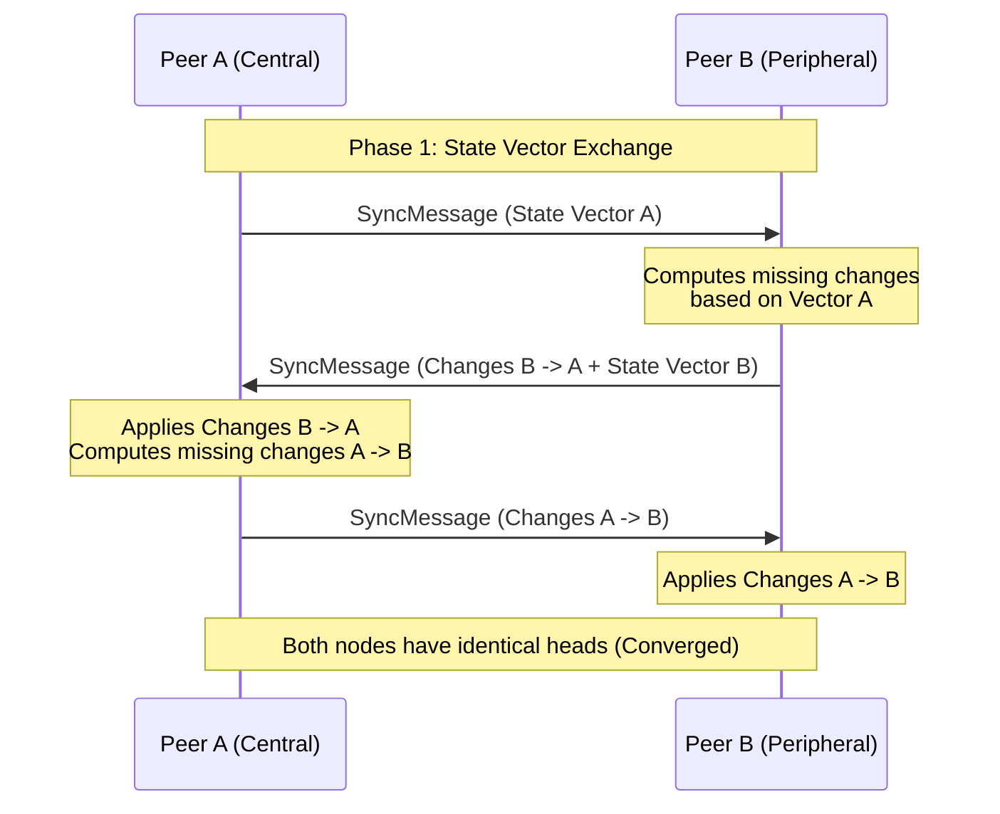

# Cycles — Single-Store CRDT & Storage Architecture

Cycles achieves sub-millisecond reactive UI updates alongside deterministic, multi-peer conflict resolution through its **Single-Store Architecture**: a unified model where standard relational SQLite tables and Automerge binary change vectors co-exist within the same local database file (`cycles.sqlite`).

---

## 1. The Single-Store Problem & Solution

### 1.1. The Dual-Database Anti-Pattern
Most local-first CRDT applications fall into one of two failure modes:
1. **CRDT Only**: The entire state lives in a CRDT document. Complex queries (e.g., sorting tasks by priority, filtering by tags, joining projects) require linear memory scans, leading to sluggish UI updates on mobile devices.
2. **Dual Database**: The app maintains both an SQLite database for the UI and an Automerge document file on disk. Inevitably, state drifts out of sync due to interrupted writes, crash loops, or divergent schemas.

### 1.2. The Cycles Single-Store Solution
Cycles resolves this by using **SQLite as the physical host for both worlds**:

```
cycles.sqlite
┌─────────────────────────────────────────────────────────────┐
│ 1. Relational Engine (Managed by Drift in Dart)             │
│    - tasks table (id, title, notes, due, priority, tags...) │
│    - projects table (id, name, color, icon)                 │
│    - peer_store table (device_id, name, trusted, last_seen) │
│    - relay_settings table (relay_url, auth_token, enabled)  │
├─────────────────────────────────────────────────────────────┤
│ 2. CRDT Binary Log (Managed by Rust cycles_core)           │
│    - sync_changes table (actor_id, change_bytes, hash...)  │
└─────────────────────────────────────────────────────────────┘
```

- **Read Path**: The Flutter UI queries Drift relational tables via reactive streams (`watchAllTasks()`). SQL indexes ensure instant sorting, tag filtering, and search.
- **Write Path**: Local mutations update Drift tables and emit structured events to `SyncBridge`. Rust writes an incremental Automerge binary change into `sync_changes`.
- **Sync Ingestion**: Inbound sync payloads merge into the Automerge document in Rust. The resulting diff updates Drift tables, immediately notifying UI streams.

---

## 2. Automerge CRDT Schema

The root Automerge document maintains a structured document tree:

```
Root
├── "tasks" (Map<TaskUUID, TaskMap>)
│    └── "d3b07384-d113-466e-a342-97b7dfb5f123"
│         ├── "id": String
│         ├── "title": String
│         ├── "notes": String
│         ├── "completed": Boolean
│         ├── "due_millis": Nullable Integer
│         ├── "priority": Integer (0..3)
│         ├── "tags": String (comma-separated or JSON list)
│         ├── "project_id": Nullable String
│         ├── "created_at_millis": Integer
│         └── "deleted": Boolean (Tombstone flag)
│
└── "projects" (Map<ProjectUUID, ProjectMap>)
     └── "a89c4501-f234-4b51-871c-e792c3a54b99"
          ├── "id": String
          ├── "name": String
          ├── "color": Integer
          └── "deleted": Boolean (Tombstone flag)
```

### 2.1. Tombstoning & Deletions
Hard deletions in a distributed system risk resurrecting deleted records if an offline peer syncs old data.
- Deletions set `deleted = true` (tombstone).
- Drift tables either mark `is_deleted = true` or purge the row locally while retaining the Automerge tombstone in `sync_changes`.
- This ensures that if Device A deletes a task and Device B edits the same task offline, the tombstone deterministically wins according to Automerge causal ordering.

---

## 3. Synchronization Protocol & Convergence

Cycles uses Automerge's two-phase vector clock synchronization protocol ([`rust/src/crdt.rs`](file:///home/zenmi/Projects/Cycle/rust/src/crdt.rs)):



### 3.1. Generating Sync Messages
1. Each node maintains a `SyncState` tracking what the other peer has already seen.
2. `cycles_crdt_generate_sync_message(doc, sync_state)` outputs the minimal byte payload required to advance the peer's state.
3. If no new changes exist, it produces an empty or acknowledgment message, terminating the round.

### 3.2. Multi-Round Loop Protection
To prevent infinite ping-pong loops during network stalls or repeated retries:
- The orchestrator tracks a `round_count` counter.
- If no new changes are produced or merged over consecutive messages, the sync cycle gracefully concludes.

---

## 4. Conflict Resolution Examples

### 4.1. Concurrent Title Edits (LWW on Field Level)
- Peer A changes title to `"Buy oat milk"`.
- Peer B changes title to `"Buy almond milk"`.
- **Resolution**: Automerge uses deterministic Lamport timestamps and tie-breaking actor IDs. One title wins deterministically across all devices. Neither record is corrupted.

### 4.2. Concurrent Edit vs Complete
- Peer A updates task notes on desktop.
- Peer B marks the task as completed on mobile.
- **Resolution**: Because fields are stored as separate keys in the task map, **both changes preserve cleanly**. The resulting merged task has the updated notes *and* is marked completed!
