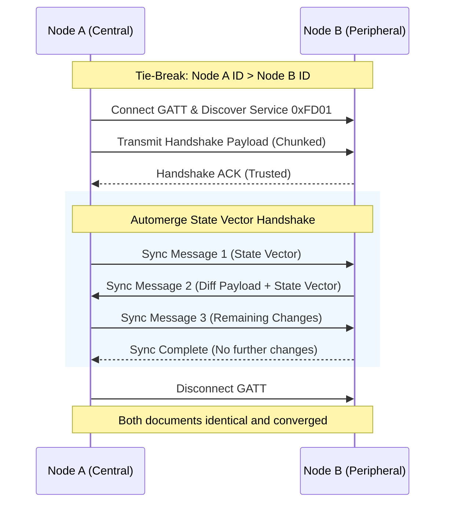

# Cycles Proximity Sync Protocol Specification

**Version 1.0.0** · Status: Stable · Transport: BLE GATT (Primary)

This document defines the wire format, state machine, and communication protocol used by Cycles for peer-to-peer proximity data synchronization.

---

## 1. Protocol Constants

| Parameter | Value | Description |
|---|---|---|
| **Service UUID** | `0000fd01-0000-1000-8000-00805f9b34fb` | 16-bit alias `0xFD01` - Cycles Sync GATT Service |
| **Sync Characteristic UUID** | `0000fd02-0000-1000-8000-00805f9b34fb` | Write Without Response / Read / Notify |
| **Advertising Name Prefix** | `Cycles-` | Prefix followed by 8-character hex device ID |
| **Frame Header Size** | 10 bytes | 2B `MsgId` + 2B `Seq` + 2B `TotalChunks` + 4B `CRC32` |
| **Default Safe Chunk Size** | 240 bytes | Fits within standard BLE ATT MTU limits |

---

## 2. Discovery & Role Assignment

### 2.1. Presence Advertising
Every Cycles node with active presence advertises a standard BLE advertisement:
- **Local Name**: `Cycles-<short_id>` (where `<short_id>` is an 8-character hexadecimal identifier derived from the node's persistent UUID).
- **Service UUID**: Advertises Service UUID `0xFD01`.

### 2.2. Deterministic Tie-Breaking
To prevent dual-advertiser collision when two nodes detect each other simultaneously:

1. Let $A$ be Local Node with Device ID $\text{ID}_A$.
2. Let $B$ be Remote Node with Device ID $\text{ID}_B$.
3. Lexicographical comparison determines the connection role:
   - If $\text{ID}_A > \text{ID}_B$: Node $A$ assumes the **Central** role (initiates GATT connection).
   - If $\text{ID}_A < \text{ID}_B$: Node $A$ remains **Peripheral** (waits for Node $B$ to connect).
   - If $\text{ID}_A = \text{ID}_B$: Handshake is aborted (loopback / ID collision).

---

## 3. Byte-Pipe Framing Protocol

BLE GATT attributes are constrained by negotiated ATT MTU sizes. To transmit arbitrarily sized Automerge CRDT sync messages (which may span hundreds of kilobytes), payloads are segmented into discrete binary frames.

### 3.1. Frame Layout

```
 0                   1                   2                   3
 0 1 2 3 4 5 6 7 8 9 0 1 2 3 4 5 6 7 8 9 0 1 2 3 4 5 6 7 8 9 0 1
+-+-+-+-+-+-+-+-+-+-+-+-+-+-+-+-+-+-+-+-+-+-+-+-+-+-+-+-+-+-+-+-+
|          Message ID           |        Sequence Number        |
+-+-+-+-+-+-+-+-+-+-+-+-+-+-+-+-+-+-+-+-+-+-+-+-+-+-+-+-+-+-+-+-+
|         Total Chunks          |                               |
+-+-+-+-+-+-+-+-+-+-+-+-+-+-+-+-+                               +
|                    Chunk Payload (N bytes)                    |
|                             ...                               |
+-+-+-+-+-+-+-+-+-+-+-+-+-+-+-+-+-+-+-+-+-+-+-+-+-+-+-+-+-+-+-+-+
|                       CRC-32 Checksum                         |
+-+-+-+-+-+-+-+-+-+-+-+-+-+-+-+-+-+-+-+-+-+-+-+-+-+-+-+-+-+-+-+-+
```

### 3.2. Field Definitions

- **Message ID (2 bytes, Big-Endian)**: Unique identifier for the logical message being transmitted.
- **Sequence Number (2 bytes, Big-Endian)**: 0-indexed position of this chunk within the overall message.
- **Total Chunks (2 bytes, Big-Endian)**: Total number of chunks composing this message ($N$).
- **Chunk Payload ($N$ bytes)**: Raw slice of the message payload.
- **CRC-32 Checksum (4 bytes, Big-Endian)**: IEEE 802.3 CRC-32 computed over the Chunk Payload bytes.

### 3.3. Reassembly Rules

1. When a chunk arrives, the receiver validates the CRC-32 checksum. If it fails, the chunk is discarded.
2. Chunks are stored in a buffer indexed by `(Message ID, Sequence Number)`.
3. Out-of-order chunks are accepted.
4. Once all chunks $0 \dots (\text{TotalChunks}-1)$ are received, the complete payload is concatenated in sequence and delivered to the CRDT parser.

---

## 4. Handshake & TOFU Protocol

Before syncing CRDT documents, nodes perform a lightweight Trust On First Use (TOFU) identity verification:

```json
{
  "device_id": "a1b2c3d4",
  "public_key": "pubkey-bytes...",
  "display_name": "Cycles-a1b2c3d4"
}
```

- If the peer's `device_id` is unknown, it is added to the local peer store with `trusted = true` (TOFU).
- If the peer was previously marked untrusted by the user, the sync session is rejected.

---

## 5. Automerge CRDT Sync Exchange

Once the byte pipe is established, the session executes an Automerge synchronization state machine:



1. **Step 1**: Central generates an initial Automerge sync message containing its local state vector.
2. **Step 2**: Peripheral ingests the sync message, merges changes, and generates a response containing changes needed by Central plus its updated state vector.
3. **Step 3**: The exchange repeats until both nodes report `generate_sync_message() == None`.
4. **Step 4**: Both nodes write the updated state to their local SQLite stores and update Drift's relational tables.
