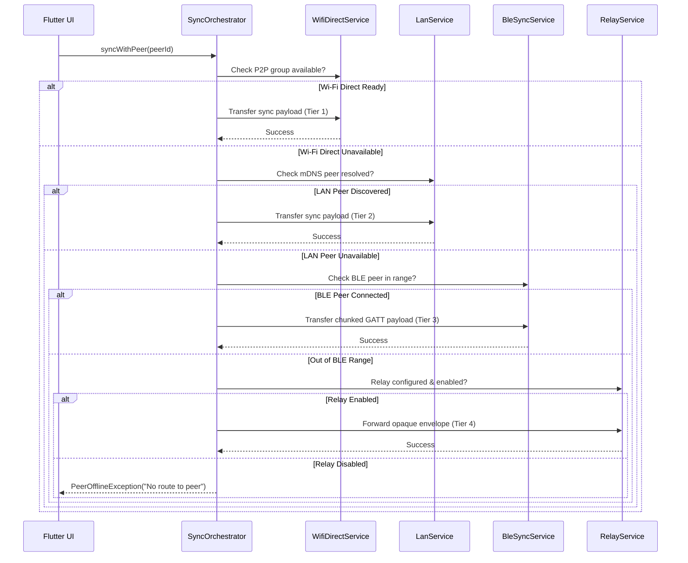

# Cycles — Multi-Tier Transport Architecture

Cycles is built on a resilient, multi-tier transport cascade. It prioritizes the highest-bandwidth, lowest-friction local peer-to-peer connection available, transparently falling back to proximity BLE or an optional zero-knowledge relay when devices are out of range.

---

## 1. Transport Hierarchy & Priority

The transport orchestrator ([`lib/services/sync_orchestrator.dart`](file:///home/zenmi/Projects/Cycle/lib/services/sync_orchestrator.dart)) evaluates connections in descending order of performance and peer availability:

```
┌─────────────────────────────────────────────────────────────┐
│                   SyncOrchestrator Cascade                  │
│                                                             │
│   [ Tier 1: Wi-Fi Direct P2P ]     ~15–50 MB/s, Direct P2P  │
│                │ (if unavailable)                           │
│                ▼                                            │
│   [ Tier 2: Local LAN (mDNS) ]     ~5–20 MB/s, Shared Wi-Fi │
│                │ (if unavailable)                           │
│                ▼                                            │
│   [ Tier 3: Proximity BLE GATT ]   ~50–200 KB/s, Off-Grid   │
│                │ (if out of range)                          │
│                ▼                                            │
│   [ Tier 4: Remote Relay ]         Variable, Zero-Knowledge│
└─────────────────────────────────────────────────────────────┘
```

| Priority | Tier Name | Discovery Mechanism | Data Channel | Typical Throughput | Requirements |
|---|---|---|---|---|---|
| **1** | **Wi-Fi Direct P2P** | Wi-Fi P2P Service Discovery / Pre-association | TCP socket on port `47226` | 15–50 MB/s | Android / Windows Wi-Fi Direct hardware |
| **2** | **Local LAN** | mDNS / DNS-SD (`_cycles-sync._tcp`) | TCP socket on port `47225` | 5–20 MB/s | Devices on same local subnet / router |
| **3** | **Proximity BLE** | BLE Advertising (`Cycles-<id>`, `0xFD01`) | BLE GATT characteristic `0xFD02` | 50–200 KB/s | Bluetooth 4.2+ LE radio, zero external infra |
| **4** | **Remote Relay** | Explicit configuration + peer device ID | WebSocket to Go relay server | Variable | Internet access, opt-in relay settings |

---

## 2. Tier 1: Wi-Fi Direct P2P

### 2.1. Overview
Wi-Fi Direct provides a high-speed, device-to-device Wi-Fi connection without requiring a wireless router or hotspot. It is ideal for large initial document syncs or media-heavy attachments.

- **Port**: `47226`
- **Native Android Controller**: [`android/app/src/main/kotlin/com/example/cycles/WifiDirectPlugin.kt`](file:///home/zenmi/Projects/Cycle/android/app/src/main/kotlin/com/example/cycles/WifiDirectPlugin.kt) (`cycles/wifi_direct` method channel)
- **Dart Service**: [`lib/services/wifi_direct_service.dart`](file:///home/zenmi/Projects/Cycle/lib/services/wifi_direct_service.dart)
- **Rust Transport**: [`rust/src/wifi_direct/transport.rs`](file:///home/zenmi/Projects/Cycle/rust/src/wifi_direct/transport.rs)

### 2.2. Connection Flow
1. **Group Negotiation**: Android's `WifiP2pManager.connect()` negotiates Group Owner (GO) status with the target peer.
2. **Socket Establishment**:
   - Group Owner binds a `ServerSocket` on port `47226`.
   - Client resolves the GO's group owner IP address from `WifiP2pInfo` and connects.
3. **Symmetric Framing & Tie-Breaking**: Reuses the standard Cycles 10-byte binary frame header (`MsgId` + `Seq` + `TotalChunks` + `CRC32`) over the raw stream for consistency and packet integrity.

---

## 3. Tier 2: Local LAN (mDNS Fast-Path)

### 3.1. Overview
When devices share a Wi-Fi or wired network, Cycles bypasses BLE GATT throughput constraints by advertising and discovering peer nodes via Multicast DNS.

- **Port**: `47225`
- **mDNS Service Type**: `_cycles-sync._tcp.local.`
- **Rust Implementation**: [`rust/src/lan/discovery.rs`](file:///home/zenmi/Projects/Cycle/rust/src/lan/discovery.rs) & [`rust/src/lan/transport.rs`](file:///home/zenmi/Projects/Cycle/rust/src/lan/transport.rs)

### 3.2. mDNS TXT Records
Advertisements publish metadata in TXT records:
```
device_id = 4a9f12b0
port      = 47225
name      = Alice's Phone
version   = 1
```

### 3.3. Handshake & Tie-Breaking
When Node A discovers Node B on LAN:
1. Lexicographical comparison of `device_id` determines initiator:
   - If $\text{ID}_A > \text{ID}_B$, Node A connects to Node B's IP and port `47225`.
   - If $\text{ID}_A < \text{ID}_B$, Node A waits for Node B's inbound connection.
2. Both peers initiate standard Automerge sync vector exchanges over the TCP stream.

---

## 4. Tier 3: Proximity BLE GATT

### 4.1. Overview
The foundational transport of Cycles. Operates with zero network infrastructure, anywhere in the world.

- **Service UUID**: `0000fd01-0000-1000-8000-00805f9b34fb` (Alias `0xFD01`)
- **Characteristic UUID**: `0000fd02-0000-1000-8000-00805f9b34fb` (Alias `0xFD02`)
- **Advertising Pattern**: `Cycles-<8_hex_device_id>`
- **Dart Service**: [`lib/services/ble_sync_service.dart`](file:///home/zenmi/Projects/Cycle/lib/services/ble_sync_service.dart)
- **Rust Engine**: [`rust/src/ble/`](file:///home/zenmi/Projects/Cycle/rust/src/ble/)
- **Full Wire Specification**: See [SYNC_PROTOCOL.md](file:///home/zenmi/Projects/Cycle/docs/SYNC_PROTOCOL.md).

### 4.2. Chunking & CRC-32 Verification
Because BLE GATT ATT MTU may be negotiated as low as 23 bytes (standard safe payload 240 bytes), larger Automerge binary change vectors are chunked into 10-byte binary header frames:

```
┌───────────────┬───────────────┬──────────────────┬─────────────────────┬──────────────┐
│ MsgId (2B BE) │  Seq (2B BE)  │ TotalChunks (2B) │  Payload (N Bytes)  │ CRC32 (4B BE)│
└───────────────┴───────────────┴──────────────────┴─────────────────────┴──────────────┘
```

Frames that arrive out of order are cached by sequence number. Corrupted frames with mismatched CRC32 are discarded and re-requested.

---

## 5. Tier 4: Remote Zero-Knowledge Relay

### 5.1. Overview
An opt-in, privacy-preserving transport for situations where devices are not physically proximate and not on the same network (e.g. syncing between office desktop and home phone).

- **Implementation**: Standalone Go service ([`relay-server/`](file:///home/zenmi/Projects/Cycle/relay-server/)) and Rust client ([`rust/src/relay/`](file:///home/zenmi/Projects/Cycle/rust/src/relay/)).
- **Zero-Knowledge Guarantee**: The relay server is a dumb store-and-forward pipe. It routes opaque binary payloads between connected `device_id` endpoints. It cannot decrypt or inspect Automerge documents or task contents.
- **Wire Format**: WebSocket with shared-secret token authentication and JSON or binary envelope routing.
- **Full Guide**: See [docs/RELAY_DEPLOYMENT.md](file:///home/zenmi/Projects/Cycle/docs/RELAY_DEPLOYMENT.md).

---

## 6. Dynamic Failover & Orchestration

The `SyncOrchestrator` maintains an active transport session cache and triggers automatic fallback:


